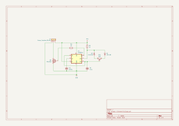

Simple dimmer
=============

This is a simple LED dimmer PCB based on the common 555 timer IC.

The motivation behind this project was to introduce my friend into the world of electronics. As we have a boat with way too bright LED strip, a dimmer would be both a simple first project and still very useful. My friend designed the schematic based on the [555 datasheet](https://www.ti.com/lit/ds/symlink/lm555.pdf) and [a tutorial on PWM dimmers](https://www.electronicshub.org/pwm-led-dimmer-using-ne555/). Our next step is to manufacture the PCB at our university's electronics lab. This is also going to be an experiment for me to see how good are the facilities, and what does the end result look like. The final step is to let my friend solder all components on the PCB.

Pictures
--------

